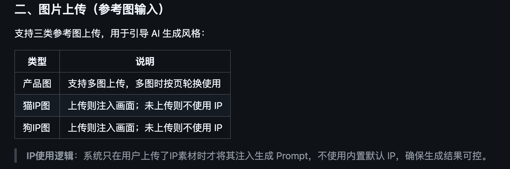
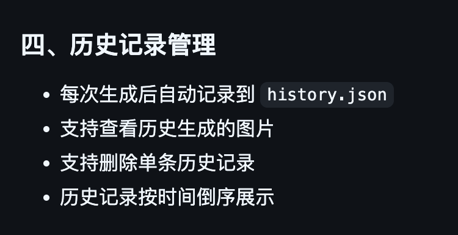

<div align="center">

# 🐾 XP-FoodChain 图文笔记生成器

**AI 驱动的小红书图文笔记一键生成工具**

输入产品信息，自动生成多页竖版图文笔记，支持预览编辑后一键出图

[](https://python.org)
[](https://flask.palletsprojects.com)
[]()

</div>

---

## 🚀 快速启动

```bash
# 安装依赖
pip install -r requirements.txt

# 启动服务
python3 app.py
```

启动后浏览器访问 **http://localhost:5188** 即可使用

---

## ✨ 功能一览

### 📝 图文笔记生成
填写产品信息后，两步完成生成：

1. **AI 生成骨架** — 自动生成每页的标题、信息要点、画面描述，内置叙事结构（封面吸引 → 误区揭示 → 解决方案 → 科学背书 → 行动号召）
2. **预览 & 编辑** — 在页面中直接修改骨架内容，确认满意后再出图
3. **AI 出图** — 根据骨架批量生成图片，支持 1 / 3 / 5 张按需选择，竖版 3:4 适配移动端

### 🎛️ 可配置项

| 配置项 | 说明 |
|:---|------|
| 产品名称 | 必填，自由输入 |
| 核心卖点 | 逗号或换行分隔，AI 据此生成每页内容 |
| 目标受众 | 自由输入，默认"养猫宠主" |
| 内容主题 | 自由输入，如：误区科普、成分解析、产品介绍等 |
| 图文张数 | 1 / 3 / 5 张可选 |
| 风格描述 | 自由输入，如：温馨自然、现代简约、高级质感等 |
| 品牌色 | 颜色选择器，默认自然绿 |
| 特殊要求 | 自由输入补充说明 |

### 🖼️ 参考图上传
- **产品图** — 支持多张上传，生成时按页轮换使用
- **IP 形象图** — 支持上传猫 / 狗 IP 素材，引导画面风格（不上传则不使用）

<p>
  
</p>

### 📦 其他功能
- 📜 生成历史记录，支持查看、下载和删除

<p>
  
</p>

- 📥 一键打包 **ZIP** 下载全部图片

---

## ⚙️ 技术栈

<p>
  
  
  
  
  
</p>

---

<div align="center">

**Made with ❤️ for 食物链**

</div>
